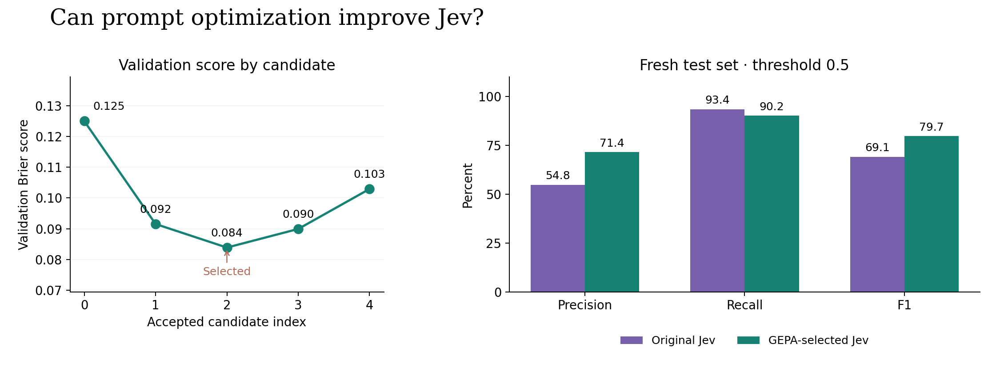
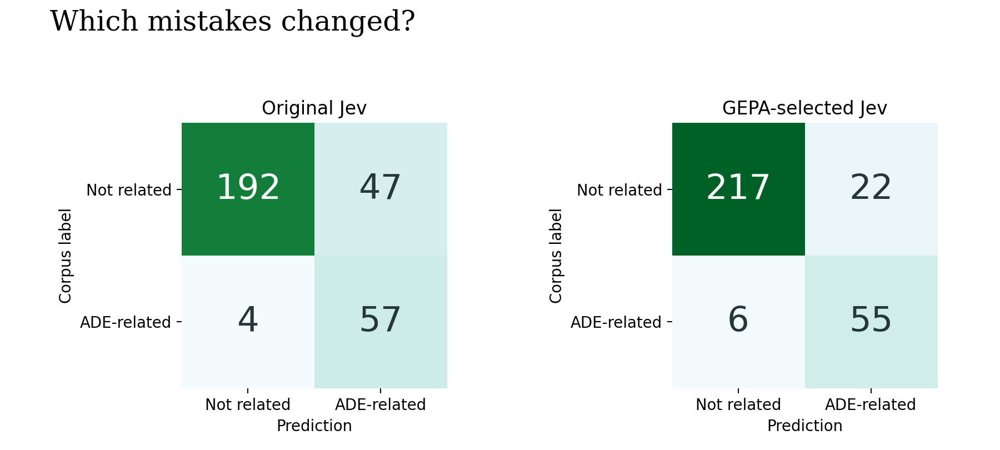

# Jev + GEPA: a measured prompt-optimization pilot

Praneeth Paikray · September 19, 2026

GEPA reduced Brier error on the fresh test set. The original prompt scored 0.1357; the selected prompt scored 0.0747. ADE F1 changed from 69.1% to 79.7%, while recall changed from 93.4% to 90.2%. These results come from 300 fresh sentences, not the test set used in the first article.

## What we combined

Jev performs the sentence classification. GEPA revises the question instructions and the two class definitions, tests candidate revisions, and selects a candidate using validation scores. Jev's model weights and the two output labels stay fixed. This is prompt optimization, not model fine-tuning.

The integration uses the actual `gepa` Python package, version 0.1.4, through its custom adapter and custom-proposer interfaces. GEPA controls minibatch sampling, acceptance, candidate selection from the Pareto frontier, and validation scoring. The conversation assistant supplied the four reflection proposals. This was an assistant-driven pilot, not a run using an independently versioned reflection-model API. The package includes a callable-proposer alternative for automating that part with a configured generative model. [GEPA source and integration interfaces](https://github.com/gepa-ai/gepa)

Jev cannot provide that reflection itself because it does not generate the revised instruction text. Its role remains the inexpensive decision model being evaluated. [Jev's decision interface](https://docs.typesafe.ai/models)

The feedback contains the training sentence, its corpus label, and Jev's probabilities. It contains no model rationale: the API does not return a reasoning trace for us to inspect.

## Protocol fixed before testing

The source is the same pinned ADE Corpus V2 revision as the original experiment. We excluded all 500 sentences previously evaluated with Jev and selected another 500 from the unused Jev pool. Identical normalized sentences cannot cross the new partitions.

| Partition | Sentences | Positive labels | Purpose |
| --- | ---: | ---: | --- |
| Training | 100 | 20 | Reflection examples |
| Validation | 100 | 21 | Candidate selection and review cutoffs |
| Fresh test | 300 | 61 | Final paired comparison |

The optimizer maximizes `1 - (p_ADE - label)^2` per example. Averaged over validation, this is equivalent to minimizing Brier score. It penalizes confident mistakes without optimizing ordinary accuracy on a dataset dominated by negatives. Brier also reflects discrimination and prevalence; it is not an isolated measure of calibration.

We limited the search to four proposals, 20 reflection examples per round, and at most 700 optimization metric calls. GEPA used strict minibatch improvement and Pareto candidate selection. Crossover was disabled for this small run. A proposed candidate could be rejected before a full validation evaluation. The fresh test was evaluated only after the selected candidate was saved with a timestamp and hash. The original and selected prompts were interleaved at up to 24 concurrent requests, with `jev-1.13.0` pinned throughout.

## Fresh-test results

| Metric | Original Jev | GEPA-selected Jev |
| --- | ---: | ---: |
| Brier score, lower is better | 0.1357 | 0.0747 |
| Precision | 54.8% | 71.4% |
| Recall | 93.4% | 90.2% |
| ADE F1 | 69.1% | 79.7% |
| Accuracy | 83.0% | 90.7% |
| Log loss | 1.878 | 1.002 |
| 10-bin ECE | 0.142 | 0.069 |

Classification uses the same fixed probability threshold of 0.5 for both prompts. ECE and log loss are descriptive secondary measures. Exact zero/one probabilities are numerically clipped by scikit-learn when computing log loss.

The primary paired difference, optimized minus original Brier, is -0.0609; its 95% bootstrap interval is [-0.0863, -0.0372]. The paired bootstrap interval for Brier change stays below zero. F1 changed by +10.62 percentage points, with a 95% bootstrap interval of [5.06, 16.49] points.

We resampled the same 300 sentence indices for both prompts in 5,000 paired bootstrap replicates. These intervals assume sentence-level independence and do not account for shared source articles or prompt-search variability. One search seed and one small corpus cannot establish a general advantage.

The revised prompt corrected 28 original classification errors and introduced 5 new ones. Errors here mean disagreements with the supplied corpus labels. We kept every label unchanged.

## What happened to review workload?

For each prompt, we reused the earlier review policy: choose the largest validation cutoff from 0 to 0.4, in 0.005 steps, that retains at least 95% of positive cases. A sentence with probability at or below the cutoff goes to lower priority.

| Prompt | Cutoff | Review | Lower priority | Positive cases deferred |
| --- | ---: | ---: | ---: | ---: |
| Original Jev | 0.400 | 106 | 194 | 4 |
| GEPA-selected Jev | 0.400 | 78 | 222 | 6 |

This is a secondary outcome, not the objective GEPA optimized. A lower Brier score does not guarantee a better screening policy. With only 21 validation positives, the retention target permits at most one positive case to be deferred. Lower priority means deferred review or audit, not removal from the literature workflow.

## What the revisions learned

The first reflected revision made the drug, harmful effect, and relationship explicit. It discouraged inferring causality from a drug level and an abnormal finding merely appearing together. Later proposals tested the wording for compact titles, treatment benefits, vague adverse-effect references, and background discussion. These are changes to the annotation decision boundary, not discoveries about drug safety. The selected text and all four proposed candidates are included so readers can inspect the actual changes.

The original prompt has 503 characters across its three text components; the selected prompt has 2,020. On the final test calls, average input-token usage was 424.2 for the original and 694.2 for the selected prompt. Any accuracy gain therefore comes with its measured prompt-length cost.

## Cost, scope, and reproduction

The completed search and paired test account for 1,260 successful Jev evaluations. Full response records are preserved for 1,257 of them. The append journal omitted ten records; seven were recovered from GEPA's saved outputs and the final test snapshots. Three optimization response payloads remain unavailable. All 600 final test responses and both 100-example validation sets used for the reported routing comparison are complete. No API calls were repeated to repair the logs.

Preserved usage totals 730,168 input tokens, approximately $0.03067 at $0.042 per million. This is a lower bound because those three optimization payloads lack usage metadata. It also excludes reflection cost and is not an invoice. On preserved records, median client-observed latency was 19.59 seconds; the 95th percentile was 24.37 seconds. Those timings include network and service effects. The supplied runner now writes atomic batch snapshots in addition to its append journal.

The dataset's missing article identifiers prevent a document-level split. Jev's possible pretraining exposure is unknown, and some annotations have boundaries that need expert review. GEPA can become better at matching those labels without becoming more clinically correct. We did not compare optimizers, search seeds, reflection models, or model fine-tuning.

Open `Jev_GEPA_Experiment.ipynb` to inspect the executed analysis. `experiment.py` contains the adapter, data preparation, bounded live runner, and custom proposer. `analyze.py` recomputes metrics and intervals without API calls. The default notebook mode reads saved outputs; a live run requires an explicitly configured generative reflection callable and a TypeSafe key from a secret store. The raw corpus and credentials are not included.

Sources: [GEPA paper](https://arxiv.org/abs/2507.19457), [GEPA implementation](https://github.com/gepa-ai/gepa), [ADE Corpus V2](https://huggingface.co/datasets/ade-benchmark-corpus/ade_corpus_v2).
